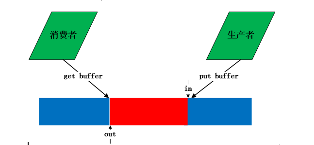
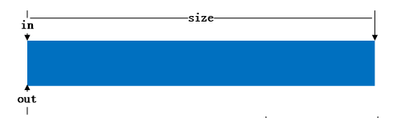
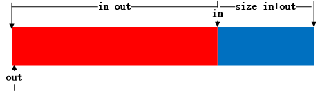
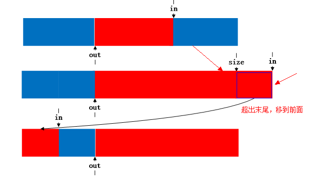

# 概论
最近项目中用到一个环形缓冲区，代码是由linux内核的kfifo改过来的。缓冲区在文件系统中经常用到，通过缓冲区缓解cpu读写内存和读写磁盘的速度。例如一个进程A产生数据发给另外一个进程B，进程B需要对进程A传的数据进行处理并写入文件，如果B没有处理完，则A要延迟发送。为了保证进程A减少等待时间，可以在A和B之间采用一个缓冲区，A每次将数据存放在缓冲区中，B每次冲缓冲区中取。这是典型的生产者和消费者模型，缓冲区中数据满足FIFO特性，因此可以采用队列进行实现。  Linux内核的kfifo正好是一个环形队列，可以用来当作环形缓冲区。生产者与消费者使用缓冲区如下图所示：  
  
环形缓冲区的详细介绍及实现方法可以参考<http://en.wikipedia.org/wiki/Circular_buffer>，介绍的非常详细，列举了实现环形队列的几种方法。环形队列的不便之处在于如何判断队列是空还是满。维基百科上给三种实现方法。
# kifo 
## kifo的数据结构
主要是分析下kfifo.h    
源码位置：  
c  文件 : <http://elixir.free-electrons.com/linux/v2.6.35/source/kernel/kfifo.c>  
.h 文件：<http://elixir.free-electrons.com/linux/v2.6.35/source/include/linux/kfifo.h#L47>  
如下是内核中使用的数据结构
```c
struct kfifo {
unsigned char *buffer;     /* the buffer holding the data */
unsigned int size;         /* the size of the allocated buffer */
unsigned int in;           /* data is added at offset (in % size) */
unsigned int out;          /* data is extracted from off. (out % size) */
spinlock_t *lock;          /* protects concurrent modifications */
};
```
个人使用是在应用中使用，所以根据该结构互锁机制使用thread机制。
```c
struct kfifo {
	unsigned char *buffer;	/* the buffer holding the data */
	unsigned int size;	/* the size of the allocated buffer */
	unsigned int in;	/* data is added at offset (in % size) */
	unsigned int out;	/* data is extracted from off. (out % size) */
	pthread_mutex_t *lock;	/* protects concurrent modifications */
};
```
## kifo 提供的方法

```c
extern void kfifo_init(struct kfifo *fifo, void *buffer,
			unsigned int size);
extern __must_check int kfifo_alloc(struct kfifo *fifo, unsigned int size,
			gfp_t gfp_mask);
extern void kfifo_free(struct kfifo *fifo);
extern unsigned int kfifo_in(struct kfifo *fifo,
				const void *from, unsigned int len);
extern __must_check unsigned int kfifo_out(struct kfifo *fifo,
				void *to, unsigned int len);
extern __must_check unsigned int kfifo_out_peek(struct kfifo *fifo,
				void *to, unsigned int len, unsigned offset);
```
定义自旋锁的目的为了防止多进程/线程并发使用kfifo。因为in和out在每次get和out时，发生改变。初始化和创建kfifo的源代码如下：
```c
struct kfifo *kfifo_init(unsigned char *buffer, unsigned int size,
              gfp_t gfp_mask, spinlock_t *lock)
 {
     struct kfifo *fifo;
     /* size must be a power of 2 */
     BUG_ON(!is_power_of_2(size));
     fifo = kmalloc(sizeof(struct kfifo), gfp_mask);
     if (!fifo)
         return ERR_PTR(-ENOMEM);
     fifo->buffer = buffer;
     fifo->size = size;
     fifo->;
     fifo->lock = lock;
 
     return fifo;
 }
 struct kfifo *kfifo_alloc(unsigned int size, gfp_t gfp_mask, spinlock_t *lock)
 {
     unsigned char *buffer;
     struct kfifo *ret;
     if (!is_power_of_2(size)) {
         BUG_ON(size > 0x80000000);
         size = roundup_pow_of_two(size);
     }
     buffer = kmalloc(size, gfp_mask);
     if (!buffer)
         return ERR_PTR(-ENOMEM);
     ret = kfifo_init(buffer, size, gfp_mask, lock);
 
     if (IS_ERR(ret))
         kfree(buffer);
     return ret;
 }
 ```
 　　在kfifo_init和kfifo_calloc中，kfifo->size的值总是在调用者传进来的size参数的基础上向2的幂扩展，这是内核一贯的做法。这样的好处不言而喻--对kfifo->size取模运算可以转化为与运算，如：kfifo->in % kfifo->size 可以转化为 kfifo->in & (kfifo->size – 1)

kfifo的巧妙之处在于in和out定义为无符号类型，在put和get时，in和out都是增加，当达到最大值时，产生溢出，使得从0开始，进行循环使用。put和get代码如下所示：
```c
static inline unsigned int kfifo_put(struct kfifo *fifo,
                 const unsigned char *buffer, unsigned int len)
 {
     unsigned long flags;
     unsigned int ret;
     spin_lock_irqsave(fifo->lock, flags);
     ret = __kfifo_put(fifo, buffer, len);
     spin_unlock_irqrestore(fifo->lock, flags);
     return ret;
 }
 
 static inline unsigned int kfifo_get(struct kfifo *fifo,
                      unsigned char *buffer, unsigned int len)
 {
     unsigned long flags;
     unsigned int ret;
     spin_lock_irqsave(fifo->lock, flags);
     ret = __kfifo_get(fifo, buffer, len);
         //当fifo->in == fifo->out时，buufer为空
     if (fifo->in == fifo->out)
         fifo->;
     spin_unlock_irqrestore(fifo->lock, flags);
     return ret;
 }
 
 unsigned int __kfifo_put(struct kfifo *fifo,
             const unsigned char *buffer, unsigned int len)
 {
     unsigned int l;
        //buffer中空的长度
     len = min(len, fifo->size - fifo->in + fifo->out);
     /*
      * Ensure that we sample the fifo->out index -before- we
      * start putting bytes into the kfifo.
      */
     smp_mb();
     /* first put the data starting from fifo->in to buffer end */
     l = min(len, fifo->size - (fifo->)));
     memcpy(fifo->buffer + (fifo->)), buffer, l);
     /* then put the rest (if any) at the beginning of the buffer */
     memcpy(fifo->buffer, buffer + l, len - l);
 
     /*
      * Ensure that we add the bytes to the kfifo -before-
      * we update the fifo->in index.
      */
     smp_wmb();
     fifo->in += len;  //每次累加，到达最大值后溢出，自动转为0
     return len;
 }
 
 unsigned int __kfifo_get(struct kfifo *fifo,
              unsigned char *buffer, unsigned int len)
 {
     unsigned int l;
         //有数据的缓冲区的长度
     len = min(len, fifo->in - fifo->out);
     /*
      * Ensure that we sample the fifo->in index -before- we
      * start removing bytes from the kfifo.
      */
     smp_rmb();
     /* first get the data from fifo->out until the end of the buffer */
     l = min(len, fifo->size - (fifo->)));
     memcpy(buffer, fifo->buffer + (fifo->)), l);
     /* then get the rest (if any) from the beginning of the buffer */
     memcpy(buffer + l, fifo->buffer, len - l);
     /*
      * Ensure that we remove the bytes from the kfifo -before-
      * we update the fifo->out index.
      */
     smp_mb();
     fifo->out += len; //每次累加，到达最大值后溢出，自动转为0
     return len;
 }
 ```
 　　put和get在调用__put和__get过程都进行加锁，防止并发。从代码中可以看出put和get都调用两次memcpy，这针对的是边界条件。例如下图：蓝色表示空闲，红色表示占用。

（1）空的kfifo  
  
（2）put一个buffer后  
   
（3）get一个buffer后  
   
4）当此时put的buffer长度超出in到末尾长度时，则将剩下的移到头部去  
   

# 修改后fifo 源码
## kfifo.h
```c
/*
 * @Author: world.lu 
 * @Date: 2017-05-27 09:41:37 
 * @Last Modified by: world.lu
 * @Last Modified time: 2017-05-27 09:42:32
 */
#include <pthread.h>
struct kfifo {
	unsigned char *buffer;	/* the buffer holding the data */
	unsigned int size;	/* the size of the allocated buffer */
	unsigned int in;	/* data is added at offset (in % size) */
	unsigned int out;	/* data is extracted from off. (out % size) */
	pthread_mutex_t *lock;	/* protects concurrent modifications */
};


extern struct kfifo *kfifo_init(unsigned char *buffer, unsigned int size, pthread_mutex_t *lock);
extern void kfifo_free(struct kfifo *fifo);
extern unsigned int __kfifo_put(struct kfifo *fifo,
				unsigned char *buffer, unsigned int len);
extern unsigned int __kfifo_get(struct kfifo *fifo,
				unsigned char *buffer, unsigned int len);

/**
 * __kfifo_reset - removes the entire FIFO contents, no locking version
 * @fifo: the fifo to be emptied.
 */
static inline void __kfifo_reset(struct kfifo *fifo)
{
	fifo->in = fifo->out = 0;
}

/**
 * kfifo_reset - removes the entire FIFO contents
 * @fifo: the fifo to be emptied.
 */
static inline void kfifo_reset(struct kfifo *fifo)
{
	

	pthread_mutex_lock(fifo->lock);

	__kfifo_reset(fifo);

	pthread_mutex_unlock(fifo->lock);
}

/**
 * kfifo_put - puts some data into the FIFO
 * @fifo: the fifo to be used.
 * @buffer: the data to be added.
 * @len: the length of the data to be added.
 *
 * This function copies at most @len bytes from the @buffer into
 * the FIFO depending on the free space, and returns the number of
 * bytes copied.
 */
static inline unsigned int kfifo_put(struct kfifo *fifo,
				     unsigned char *buffer, unsigned int len)
{
	unsigned int ret;

	pthread_mutex_lock(fifo->lock);

	ret = __kfifo_put(fifo, buffer, len);

	pthread_mutex_unlock(fifo->lock);

	return ret;
}

/**
 * kfifo_get - gets some data from the FIFO
 * @fifo: the fifo to be used.
 * @buffer: where the data must be copied.
 * @len: the size of the destination buffer.
 *
 * This function copies at most @len bytes from the FIFO into the
 * @buffer and returns the number of copied bytes.
 */
static inline unsigned int kfifo_get(struct kfifo *fifo,
				     unsigned char *buffer, unsigned int len)
{
	unsigned int ret;

	pthread_mutex_lock(fifo->lock);

	ret = __kfifo_get(fifo, buffer, len);

	/*
	 * optimization: if the FIFO is empty, set the indices to 0
	 * so we don't wrap the next time
	 */
	if (fifo->in == fifo->out)
		fifo->in = fifo->out = 0;

	pthread_mutex_unlock(fifo->lock);

	return ret;
}

/**
 * __kfifo_len - returns the number of bytes available in the FIFO, no locking version
 * @fifo: the fifo to be used.
 */
static inline unsigned int __kfifo_len(struct kfifo *fifo)
{
	return fifo->in - fifo->out;
}

/**
 * kfifo_len - returns the number of bytes available in the FIFO
 * @fifo: the fifo to be used.
 */
static inline unsigned int kfifo_len(struct kfifo *fifo)
{
	unsigned int ret;

	pthread_mutex_lock(fifo->lock);

	ret = __kfifo_len(fifo);

	pthread_mutex_unlock(fifo->lock);

	return ret;
}


```

## kfifo.c
```c
/*
 * @Author: world.lu 
 * @Date: 2017-05-26 17:51:28 
 * @Last Modified by: world.lu
 * @Last Modified time: 2017-05-27 10:05:55
 */
 /*this is copy the kernel fifo*/
 /*all the moidify is base on thread*/
#include <inttypes.h>
#include <string.h>
#include <stdlib.h>
#include <stdio.h>
#include <errno.h>
#include "omnicycle.h"


 //判断x是否是2的次方
#define is_power_of_2(x) ((x) != 0 && (((x) & ((x) - 1)) == 0))
 //取a和b中最小值
#define min(a, b) (((a) < (b)) ? (a) : (b))
/**
 * kfifo_init - allocates a new FIFO using a preallocated buffer
 * @buffer: the preallocated buffer to be used.
 * @size: the size of the internal buffer, this have to be a power of 2.
 * @gfp_mask: get_free_pages mask, passed to kmalloc()
 * @lock: the lock to be used to protect the fifo buffer
 *
 * Do NOT pass the kfifo to kfifo_free() after use! Simply free the
 * &struct kfifo with kfree().
 */
struct kfifo *kfifo_init(unsigned char *buffer, unsigned int size, pthread_mutex_t *lock)
{
	struct kfifo *fifo;

	/* size must be a power of 2 */
	if(!is_power_of_2(size))
    {
        fprintf(stderr,"size must be power of 2.\n");
        return fifo;
    }

	fifo = (struct kfifo*)malloc(sizeof(struct kfifo));
	if (!fifo)
    {
        fprintf(stderr,"Failed to malloc memory,error:%u,reason:%s",errno,strerror(errno));
        return fifo;
    }
	fifo->buffer = buffer;
	fifo->size = size;
	fifo->in = fifo->out = 0;
	fifo->lock = lock;

	return fifo;
}

#if 0
/**
 * kfifo_alloc - allocates a new FIFO and its internal buffer
 * @size: the size of the internal buffer to be allocated.
 * @gfp_mask: get_free_pages mask, passed to kmalloc()
 * @lock: the lock to be used to protect the fifo buffer
 *
 * The size will be rounded-up to a power of 2.
 */
struct kfifo *kfifo_alloc(unsigned int size, gfp_t gfp_mask, spinlock_t *lock)
{
	unsigned char *buffer;
	struct kfifo *ret;

	/*
	 * round up to the next power of 2, since our 'let the indices
	 * wrap' tachnique works only in this case.
	 */
	if (size & (size - 1)) {
		BUG_ON(size > 0x80000000);
		size = roundup_pow_of_two(size);
	}

	buffer = kmalloc(size, gfp_mask);
	if (!buffer)
		return ERR_PTR(-ENOMEM);

	ret = kfifo_init(buffer, size, gfp_mask, lock);

	if (IS_ERR(ret))
		kfree(buffer);

	return ret;
}
EXPORT_SYMBOL(kfifo_alloc);
#endif
/**
 * kfifo_free - frees the FIFO
 * @fifo: the fifo to be freed.
 */
void kfifo_free(struct kfifo *fifo)
{
	free(fifo->buffer);
	free(fifo);
}


/**
 * __kfifo_put - puts some data into the FIFO, no locking version
 * @fifo: the fifo to be used.
 * @buffer: the data to be added.
 * @len: the length of the data to be added.
 *
 * This function copies at most @len bytes from the @buffer into
 * the FIFO depending on the free space, and returns the number of
 * bytes copied.
 *
 * Note that with only one concurrent reader and one concurrent
 * writer, you don't need extra locking to use these functions.
 */
unsigned int __kfifo_put(struct kfifo *fifo,
			 unsigned char *buffer, unsigned int len)
{
	unsigned int l;

	len = min(len, fifo->size - fifo->in + fifo->out);

	/* first put the data starting from fifo->in to buffer end */
	l = min(len, fifo->size - (fifo->in & (fifo->size - 1)));
	memcpy(fifo->buffer + (fifo->in & (fifo->size - 1)), buffer, l);

	/* then put the rest (if any) at the beginning of the buffer */
	memcpy(fifo->buffer, buffer + l, len - l);

	/*
	 * Ensure that we add the bytes to the kfifo -before-
	 * we update the fifo->in index.
	 */

	fifo->in += len;

	return len;
}

/**
 * __kfifo_get - gets some data from the FIFO, no locking version
 * @fifo: the fifo to be used.
 * @buffer: where the data must be copied.
 * @len: the size of the destination buffer.
 *
 * This function copies at most @len bytes from the FIFO into the
 * @buffer and returns the number of copied bytes.
 *
 * Note that with only one concurrent reader and one concurrent
 * writer, you don't need extra locking to use these functions.
 */
unsigned int __kfifo_get(struct kfifo *fifo,
			 unsigned char *buffer, unsigned int len)
{
	unsigned int l;

	len = min(len, fifo->in - fifo->out);

	/*
	 * Ensure that we sample the fifo->in index -before- we
	 * start removing bytes from the kfifo.
	 */

	/* first get the data from fifo->out until the end of the buffer */
	l = min(len, fifo->size - (fifo->out & (fifo->size - 1)));
	memcpy(buffer, fifo->buffer + (fifo->out & (fifo->size - 1)), l);

	/* then get the rest (if any) from the beginning of the buffer */
	memcpy(buffer + l, fifo->buffer, len - l);

	/*
	 * Ensure that we remove the bytes from the kfifo -before-
	 * we update the fifo->out index.
	 */

	fifo->out += len;

	return len;
}


```
